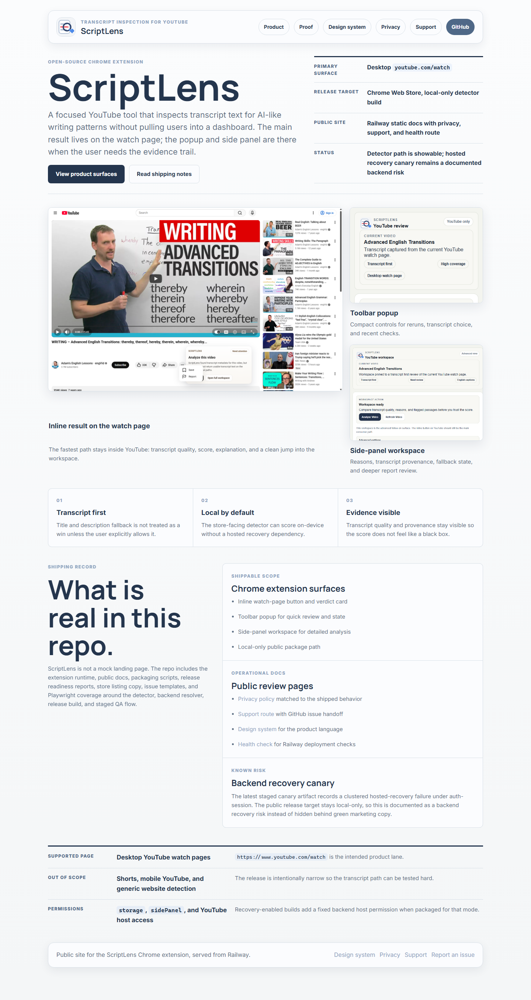
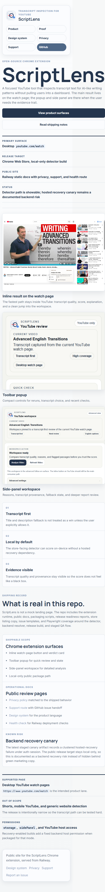

# ScriptLens

ScriptLens is an open-source Chrome extension for transcript-first YouTube analysis.

It adds an inline `Analyze video` workflow to desktop YouTube watch pages, scores AI-like writing patterns locally, and keeps hosted transcript recovery as an optional backend lane instead of a hidden dependency.

[Public site](https://synergyaiscript.up.railway.app/) | [Extension README](ai-script-detector/README.md) | [Privacy policy](ai-script-detector/docs/privacy.html) | [Support](ai-script-detector/docs/support.html)



This repository is the clean public source snapshot. Browser profiles, debug captures, canary output, and deployment credentials are deliberately excluded.

## What To Look At First

If you are reviewing the repo quickly, start here:

- `ai-script-detector/manifest.json` - Manifest V3 extension contract and permissions.
- `ai-script-detector/content.js` - page-level YouTube integration.
- `ai-script-detector/youtube-main.js` and `ai-script-detector/youtube-overlay.js` - inline watch-page workflow.
- `ai-script-detector/detector/` - deterministic local scoring logic.
- `ai-script-detector/transcript/` - transcript extraction, quality handling, and fallback boundaries.
- `ai-script-detector/popup.*` and `ai-script-detector/sidepanel.*` - secondary extension surfaces.
- `ai-script-detector/tests/` - Playwright and release-safety checks.
- `ai-script-detector/release/` - packaging, backend, canary, and operations notes.
- `ai-script-detector/docs/` - public site, privacy policy, and support source.

## Product Boundary

ScriptLens is intentionally narrow:

- Supported target: desktop `https://www.youtube.com/watch?...`.
- Primary workflow: inline transcript analysis on the watch page.
- Store-facing detector: local-first scoring with deterministic heuristics.
- Optional backend: transcript recovery only, configured by deployment.
- Not in scope for the store build: Shorts, `m.youtube.com`, generic page analysis, manual text analysis, or selection capture.

That boundary is part of the product quality. The extension should not imply it can detect every AI artifact on the web.

## Screens

| Desktop public site | Mobile public site |
| --- | --- |
|  |  |

## Extension Flow

1. ScriptLens detects a supported YouTube watch page.
2. The user clicks the inline `Analyze video` action.
3. The extension reads the available transcript and scores the writing locally.
4. The result card shows verdict, score, transcript quality, explanation, and optional details.
5. The user can open the popup or side panel for deeper breakdowns.
6. If a recovery endpoint is configured, only the YouTube video ID and requested language are sent for transcript recovery.

## Repository Layout

```text
ai-script-detector/
  manifest.json         Chrome extension manifest
  content.js            supported-page entrypoint
  service-worker.js     extension background worker
  youtube-main.js       YouTube watch-page control flow
  youtube-overlay.js    inline result UI
  detector/             local scoring and signal logic
  transcript/           transcript extraction and recovery contracts
  surface/              shared UI surface helpers
  popup.*               toolbar popup
  sidepanel.*           advanced workspace
  docs/                 public site, privacy, support
  release/              canary, backend, packaging, operations notes
  scripts/              packaging and public-doc sync scripts
  store-assets/         store copy and screenshot checklist
  tests/                Playwright and release-safety tests

docs/
  GitHub Pages-compatible mirror of ai-script-detector/docs

server.js
  Railway entrypoint for the public docs site
```

## Local Setup

```bash
cd ai-script-detector
npm.cmd install
```

Load the extension unpacked:

1. Open `chrome://extensions`.
2. Enable Developer mode.
3. Click `Load unpacked`.
4. Select the `ai-script-detector` folder.

## Validation Commands

Run these from `ai-script-detector/`:

```bash
npm.cmd run ci:fast              # deterministic local gate
npm.cmd run ci:smoke             # smoke gate
npm.cmd run test:e2e             # Playwright suite
npm.cmd run test:e2e:youtube     # YouTube surface smoke
npm.cmd run build:extension      # unpacked Chrome release staging
npm.cmd run package:extension    # Chrome Web Store zip
```

Release artifacts are written to `dist/chrome-unpacked` and `dist/packages`.

## Deployment Split

- Public website and docs: Railway.
- Chrome extension package: built from `ai-script-detector`.
- Transcript recovery backend: separate Cloud Run lane.

The public release target is local-only by default. Hosted recovery is a separate backend path and should be treated as release-critical only when the package is configured to depend on it.

Backend and operations notes:

- [release/README.md](ai-script-detector/release/README.md)
- [release/CLOUD_RUN.md](ai-script-detector/release/CLOUD_RUN.md)
- [release/CONTRACTS.md](ai-script-detector/release/CONTRACTS.md)
- [release/OPERATIONS.md](ai-script-detector/release/OPERATIONS.md)

## Public Docs

Edit public docs in `ai-script-detector/docs`.

If GitHub Pages needs the root mirror, refresh it with:

```bash
cd ai-script-detector
node scripts/sync-public-docs.mjs
```

## License

[MIT](LICENSE)
